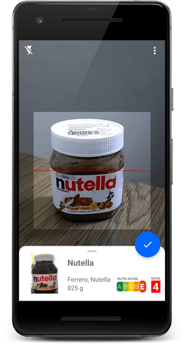
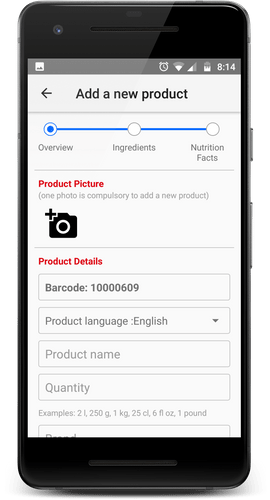
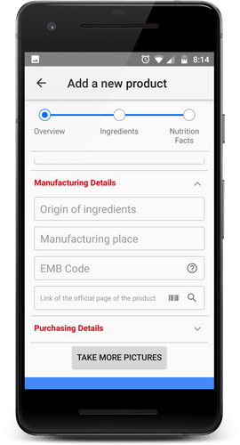
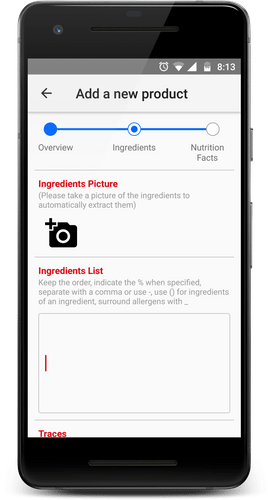
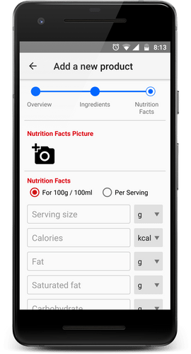
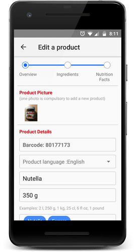

# openfoodfacts-android
Status updates for the Open Food Facts GSoC 2018 Project.

[Weekly status updates](https://github.com/openfoodfacts/openfoodfacts-androidapp/blob/master/PROJECTS/GSOC-2018-huzaifa/STATUS.md)

View the [project board](https://github.com/openfoodfacts/openfoodfacts-androidapp/projects/3)

View [GSoC 2018 Proposal](https://docs.google.com/document/d/1eJqjmyjF3zTUcASM9Go1t_w5Z0FIJM7mJeGpSQu-Ft4)

## Goals
#### Add continuous scan feature ([Bug](https://github.com/openfoodfacts/openfoodfacts-androidapp/issues/1551), [PR](https://github.com/openfoodfacts/openfoodfacts-androidapp/pull/1618/files))
This will enable users to scan barcodes at an unmatched
speed. Scanning different barcodes one after the other without any interaction with the
user.
#### Improve UI of the scan fragment ([Bug](https://github.com/openfoodfacts/openfoodfacts-androidapp/issues/1552), [PR](https://github.com/openfoodfacts/openfoodfacts-androidapp/pull/1618/files))
Redesigning the UI of the scan fragment giving an
immersive experience. Cards will be used to display the key information during the scan.
Cards will be made slidable to show the complete information just like ‘Google Maps’.
#### Thorough product addition ([Bug](https://github.com/openfoodfacts/openfoodfacts-androidapp/issues/1553), [PR](https://github.com/openfoodfacts/openfoodfacts-androidapp/pull/1712/files))
Adding more detailed product addition including its
nutritional information, ingredients, EMB codes etc.
#### Integrate OCR for ingredients([Bug](https://github.com/openfoodfacts/openfoodfacts-androidapp/issues/1554), [PR](https://github.com/openfoodfacts/openfoodfacts-androidapp/pull/1712/files))
Integrating Optical Character Recognition (OCR) for ingredients during the product addition.
#### Edit products within the app ([Bug](https://github.com/openfoodfacts/openfoodfacts-androidapp/issues/1555), [PR](https://github.com/openfoodfacts/openfoodfacts-androidapp/pull/1802/files))
Editing or adding information about the already added
products using the android application. It is more convenient and easy to use mobile and
hence this would help us in getting more products completed.

## Status at the end of GSoC 2018
* All the above goals were successfully implemented within the GSoC coding period.
* The new features have been shipped and are live on the [current version of the app](https://play.google.com/store/apps/details?id=org.openfoodfacts.scanner).

#### Screenshots

